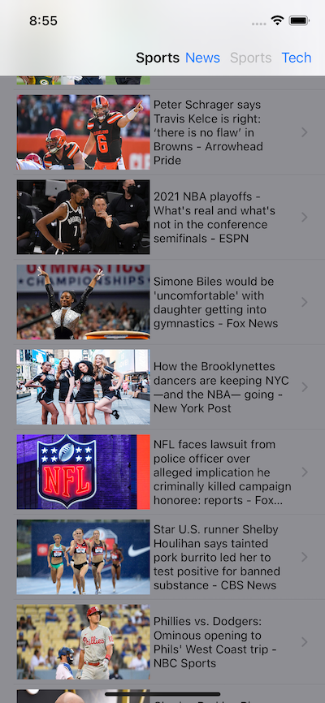

# NewsSwiftUI

NewsSwiftUI is an iOS 15 SwiftUI application that requires Xcode 13. It uses async/await throughout for updating and downloading data. It is also used in a CachedAsyncImageView, which does what the name says. It also illustrates the really nice new pull-to-refresh functionality in a List view. Really nice and easy to use. And there is a WebView to display the news story which wraps a WKWebView as a UIViewRepresentable.

I'm not putting beta 1 on my iPhone so this has only been tested with simulators. Besides needing Xcode 13 and iOS 15 you will also need to get a free api key from newsapi.org. There is a link in Network.swift.

## License

NewsSwiftUI is licensed under the Unlicense. See the LICENSE file for more information, but basically this is sample code and you can do whatever you want with it.
